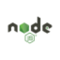

<h1 align="center">
  <picture>
    <source media="(prefers-color-scheme: dark)" srcset="ultra-header-dark.svg"/>
    
  </picture>
  </h1>
  

    <picture width="20px">
      <source media="(prefers-color-scheme: dark)" srcset="myname-dark.svg"/>
      
    </picture>
  

    <source media="(prefers-color-scheme: dark)" srcset="html5-light.svg"/>
    
    
 Video Games & Fantasy Fiction  
   
     

    <picture>
    <source media="(prefers-color-scheme: dark)" srcset="react-dark.svg"/>
    
    
    </picture>
    

    
    

<!--
**Geliaswilson/Geliaswilson** is a ✨ _special_ ✨ repository because its `README.md` (this file) appears on your GitHub profile.

Here are some ideas to get you started:

- 🔭 I’m currently working on ...
- 🌱 I’m currently learning ...
- 👯 I’m looking to collaborate on ...
- 🤔 I’m looking for help with ...
- 💬 Ask me about ...
- 📫 How to reach me: ...
- 😄 Pronouns: ...
- ⚡ Fun fact: ...
-->
